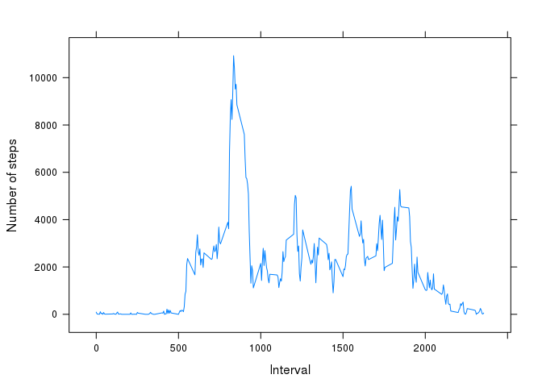
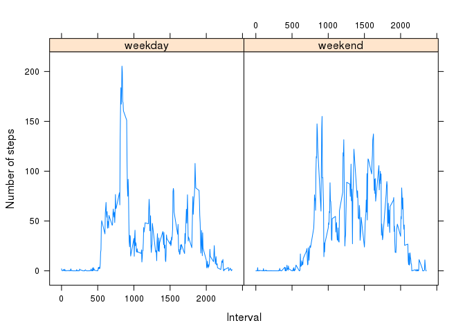

# Reproducible Research: Peer Assessment 1

The following packages are required for the processing.


```
## Loading required package: data.table
## 
## Attaching package: 'data.table'
## 
## The following object is masked _by_ '.GlobalEnv':
## 
##     .N
## 
## Loading required package: dplyr
## 
## Attaching package: 'dplyr'
## 
## The following objects are masked from 'package:data.table':
## 
##     between, last
## 
## The following object is masked from 'package:stats':
## 
##     filter
## 
## The following objects are masked from 'package:base':
## 
##     intersect, setdiff, setequal, union
## 
## Loading required package: timeDate
## Loading required package: lattice
```


## Loading and preprocessing the data

The following code loads the data and converts the date from string to date.

```r
unzip("activity.zip", overwrite = TRUE)
original <- data.table(read.csv("activity.csv")) %>% 
    mutate(date=as.Date(date)) 
```


## What is mean total number of steps taken per day?

The observations where steps is NA is ignored the rest is grouped by date and totals for steps per day calculated and a histogram displayed.

```r
bydate.totals <- original[!is.na(original$steps)] %>% 
    group_by(date) %>% 
    summarise(steps = sum(steps))

hist(bydate.totals[,steps], xlab = 'Steps', ylab = 'Day')
```

 

The mean and median for the totals per day is calculated.

```r
bydate.mean <- mean(totals)
bydate.median <- median(totals)
```

- Mean steps per day is **10766.1887**  
- Median steps per day is **10765**

## What is the average daily activity pattern?
The following code calculates the totals by interval as well as the interval with maximum number of steps and displays a line plot.

```r
byinterval.totals <- original[!is.na(original$steps)] %>% 
    group_by(interval) %>% summarise(steps = sum(steps))
byinterval.max <- filter(byinterval.totals, steps == max(steps))
max_interval <- byinterval.max[,interval]
xyplot(steps ~ interval, data = byinterval.totals, type="l", xlab="Interval", ylab="Number of steps")
```

 

Interval with maximum steps is **835**

## Imputing missing values
The following code determines number of observations with missing steps and replaces NA values with the median for the same interval and creates a new combined data set.

```r
byinterval.medians <- original[!is.na(original$steps)] %>% 
    group_by(interval) %>% 
    summarise(steps = median(steps))
missingCount <- nrow(original[is.na(original$steps)])
orig_clean <- original[!is.na(original$steps)]
newdata <- original[is.na(original$steps)] %>% 
    mutate(steps = byinterval.medians[byinterval.medians$interval == interval,steps])
newdt <- rbindlist(list(orig_clean, newdata))
```

Missing Data Count is **2304**

The following code calculates total steps by date and displays a histogram for new dataset.

```r
newbydate.totals <- newdt %>% group_by(date) %>% summarise(steps = sum(steps))
hist(newbydate.totals[,steps], xlab = 'Steps', ylab = 'Day')
```

 

The following code determines the changes with new dataset.

```r
newbydate.mean <- mean(newtotals)
newbydate.median <- median(newtotals)

descmean <- "same"
if(newbydate.mean > bydate.mean) {
    descmean <- "greater"
} else if(newbydate.mean < bydate.mean) {
    descmean <- "smaller"
}
descmedian <- "same"
if(newbydate.median > bydate.median) {
    descmedian <- "greater"
} else if(newbydate.median < bydate.median) {
    descmedian <- "smaller"
}
```

- Mean steps per day **9503.8689**. The new mean steps is smaller  
- Median steps per day **10395**. The new median steps is smaller

## Are there differences in activity patterns between weekdays and weekends?
The following code adds a factor indicating weekday or weekend values and calulates the means by interval.

```r
byweekday.totals <- newdt %>% 
    mutate(weekday = factor(ifelse(isWeekend(date), "weekend", "weekday"))) %>% 
    group_by(interval, weekday) %>% 
    summarise(means = mean(steps))
```

The following plot shows a side by side comparison of weekday and weekend activity.

```r
xyplot(means ~ interval | weekday, data = byweekday.totals, type="l", xlab="Interval", ylab="Number of steps")
```

 
